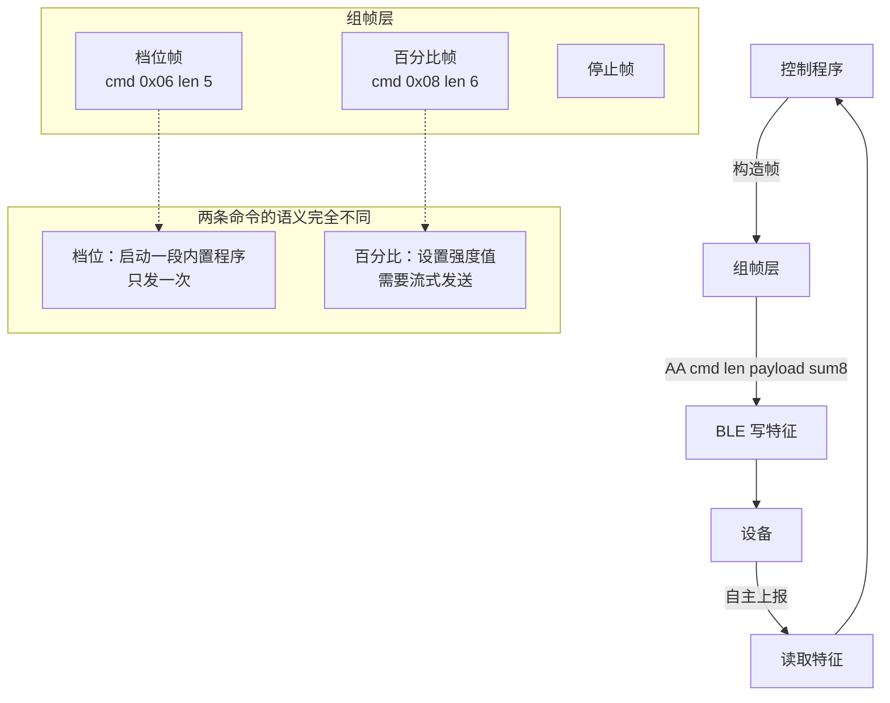

# 谜姬「计算者-X」BLE 协议

从官方 App 的 JS 里挖出来的控制协议，加上逐档实测的结论。

**来源**：App v3.7.1 反编译 + 本机实测
**适用范围**：仅限自己拥有的设备

## 协议分层



## BLE 层

| 项 | 说明 |
|---|---|
| 服务 | 见 `miji_ctrl.py` 里的常量 |
| 写特征 | 用于下发命令 |
| 读特征 | 设备主动上报 |
| 地址类型 | 部分设备需要 `addrType=1`（随机地址） |

扫设备：

```bash
python ble_probe.py
```

> 本项目的设计是走 ESP32 网关，电脑一般不直连蓝牙。`ble_probe.py` 只在排查时用。

## 帧格式

```
AA <命令> <长度> <载荷…> <校验和>
                        ↑ 前面所有字节求和 & 0xFF
```

| 字段 | 长度 | 说明 |
|---|---|---|
| 头 | 1 | 固定 `0xAA` |
| 命令 | 1 | 见下表 |
| 长度 | 1 | 载荷字节数（不含头和校验） |
| 载荷 | N | 各命令不同 |
| 校验 | 1 | 前面所有字节求和后取低 8 位 |

## 命令一览

| 命令 | 长度 | 作用 | 发送方式 |
|---|---|---|---|
| `0x06` | 5 | 五路模式（档位） | **只发一次** |
| `0x08` | 6 | 电机控制（百分比） | 流式（~10 Hz） |
| 其他 | — | 计数 / 加热 / 停止 | 见下文 |

## 电机控制

### 档位模式 —— `cmd 0x06`，长度 5

```
AA 06 05 <伸缩档> <震动档> <第3路> <第4路> <第5路> <sum>
```

| 字节 | 含义 | 范围 |
|---|---|---|
| 1 | 伸缩档 | 0–6（7 以上无反应） |
| 2 | 震动档 | 0–9 |
| 3–5 | 其他电机 | 本机不存在对应硬件，填 0 |

**发送方式：只发一次。**

这不是强度值，是「**启动一段内置程序**」的命令。设备收到就开始跑，然后自己结束。

⚠ 以 10 Hz 重复发送 = 每秒把程序重启十次，推拉被切成碎片，听感变成「嗡嗡的震动」—— **所有档位听起来都一样**。这是最早困扰了很久的问题，官方 App 实测每次改档只发一条。

### 百分比模式 —— `cmd 0x08`，长度 6

```
AA 08 06 <伸缩%> <震动%> 0 0 0 0 <sum>
```

| 字节 | 含义 | 范围 |
|---|---|---|
| 1 | 伸缩百分比 | 0–99 |
| 2 | 震动百分比 | 0–99 |
| 3–6 | 保留 | 填 0 |

**发送方式：流式（~10 Hz）。** 和档位帧的语义完全不同，不能混用。

> ⚠ 100% 才等于 3 档。**走这条路永远够不到节奏档（4 档以上）。**

### 档位语义（逐档实测）

**只有 1~3 是真正的强度**，4 以上全是节奏程序。

#### 伸缩

| 档 | 实际行为 |
|---|---|
| 0 | 关 |
| **1** | 幅度 · 弱 |
| **2** | 幅度 · 中 |
| **3** | 幅度 · 强 |
| **4** | 节奏：伸缩 5 次 + 停顿，循环 |
| **5** | 节奏：伸缩 8 次 + 停顿，循环　⚠ **会自行驱动震动电机** |
| **6** | 节奏：伸缩 3 次 + 停顿，循环 |
| 7 / 8 / 9 | **无反应**（App 允许推到 9，设备只认到 6） |

#### 震动

| 档 | 实际行为 |
|---|---|
| 0 | 关 |
| **1** | 幅度 · 弱 |
| **2** | 幅度 · 中 |
| **3** | 幅度 · 强 |
| 4 | 节奏：3 档强度 + 停一下 + 循环 |
| 5 | 节奏：3 档强度，时长中等，一直循环 |
| 6 | 节奏：3 档短震动反复 |
| 7 | 节奏：一短一长的 3 档震动 |
| 8 | 节奏：像 5 档但更短 |
| 9 | 节奏：像 4 档但更长 |

**震动 4–9 档的强度全部锁在 3 档** —— 变的只有节奏。用这些档位怎么调都觉得「差不多强」，原因就在这。

### 两条反直觉的结论

**① 伸缩第 5 档会自行驱动震动电机。**

设备收到 `AA 06 05 05 00 00 00 00 BA`，**震动字节是 0**，但实测「弄完之后震动开了」。而且在「只发一次」模式下依然出现。

→ 这不是重发频率造成的，是**那段内置程序本身就会去驱动震动电机**。

> **推论：`震动字节 = 0` 不代表「没有震动」。**
> 「两个独立旋钮，想轻就都调小」这个假设在这台设备上不成立。

**② 官方 App 的参数表有虚档。**

App 允许把伸缩推到 9，但设备只认到 6。七个内置模式里也有类似情况（见下）。

**换设备必须自己重新实测一遍**，别信官方参数表。

## 内置模式

App 里的五个模式其实就是五组档位组合：

| 模式 | 档位组合 | 本机实测效果 |
|---|---|---|
| 如影随形 | `[4, 6, 5, 0]` | 伸缩 4 节奏 + 震动 6 节奏 + 第 3 路 5（本机没有） |
| **疾风炫舞** | `[8, 9, 9, 0]` | **伸缩 8 超上限无反应** → 实际只跑了震动 9 的节奏 |
| 幻影随行 | `[6, 6, 8, 0]` | 伸缩 6 节奏 + 震动 6 节奏 |
| 水光环绕 | `[2, 2, 3, 0]` | 伸缩 2 幅度 + 震动 2 幅度 |
| 神龙摆尾 | `[3, 9, 3, 0]` | 伸缩 3 幅度 + 震动 9 节奏 |

第 3/4/5 路在本机上没有对应电机，发出去无效果。

## 停止

```
AA 06 05 00 00 00 00 00 <sum>      全停（走档位通道）
AA 08 06 00 00 00 00 00 00 <sum>    全停（走百分比通道）
```

两条都能停。项目的 `levels.py` 里固化成了 `STOP_FRAMES`。

## 其他命令

| 功能 | 状态 |
|---|---|
| 计数 | 「计算者-X」的招牌功能，App 里的统计。未做完整逆向 |
| 加热 | 本机支持，未做自动化 |
| 设备上报 | 走读特征，设备主动推送状态 |

这部分项目里没用到，就停在这里了。

## 参数表（落到代码）

`levels.py` 里固化的常量：

```python
MAX_THRUST_LEVEL = 6          # 伸缩上限
MAX_VIB_LEVEL = 9             # 震动上限
THRUST_ENGAGES_VIB = {5}      # 会牵连震动的档
THRUST_AMPLITUDE_LEVELS = (1, 2, 3)   # 真正的强度区
VIB_AMPLITUDE_LEVELS = (1, 2, 3)
```

`toy_panel.py` 会把超上限的档位钳到上限，并在日志里打印该档的中文描述；发到第 5 档时额外打一条警告。

## 实测方法（换设备时照做）

```bash
档位测试台.bat
```

打开 `http://127.0.0.1:8091`，**一档一档点过去，边点边记录实际行为**。

重点记录这几项：

| 项 | 为什么要记 |
|---|---|
| 每一档的实际感觉 | 区分「强度」和「节奏」 |
| 哪一档开始变成节奏 | 找到强度区的上界 |
| 最高有效档 | 找到上限，后面都是虚档 |
| 有没有档位会牵连其他电机 | 第 5 档那种情况 |
| 模式的实际组合 | App 给的可能有虚档 |

## 踩过的坑

| # | 坑 | 现象 | 正解 |
|---|---|---|---|
| 1 | 10 Hz 重发档位帧 | 所有档位听起来一样 | 只发一次 |
| 2 | 拿百分比当强度用 | 永远够不到节奏档 | 用档位模式 |
| 3 | 以为 `vib=0` 就没震动 | 恢复期意外触发复合程序 | 知道第 5 档会牵连震动 |
| 4 | 信 App 的参数表 | 7/8/9 是虚档，白试很久 | 逐档实测 |
| 5 | 两条通道混用发送方式 | 百分比不流式就没反应 | 记住语义不同 |

## 免责

协议是从**自己购买的设备**上逆向和实测得来的，仅供个人技术学习与研究。

- 不涉及任何在线服务、厂商服务器或账号
- 换设备请自行实测，本项目不保证协议通用

---

*这份文档由 DeepSeek 协助整理。*
