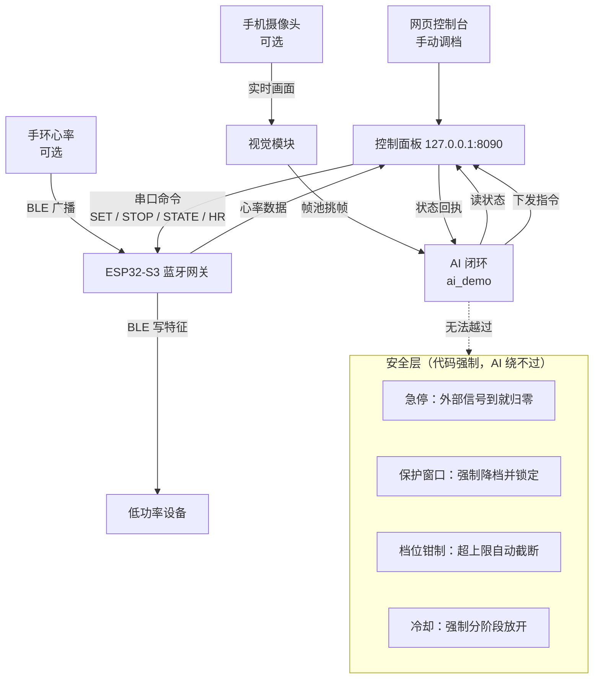

# Miji Calc-X 蓝牙设备控制

把一个只能手点官方 App 的蓝牙设备，接进可编程、可被 AI 驱动的控制流程。

设备、ESP32 网关和网页控制台是核心。手机摄像头和手环心率是可选增强；接入摄像头后，AI 不只看心率数字，也能"看见"现场的手部动作和身体反应。

本项目面向本地自用与二次开发。安装并启动控制台后，你可以手动调档，也可以让 AI 自己决定下发什么、什么时候停、什么时候收手。请只在希望获得这种自动化体验时使用，并始终把安全词和硬件急停放在第一位。

## 工作原理



控制台默认只监听本机 `127.0.0.1:8090`。档位指令是「设置状态」型命令，发出后设备自己跑一段内置程序；网页和 AI 都不需要持续重发。

可选模块都是纯增强：不接摄像头和手环，控制台和 AI 依然能正常工作，只是少两路输入。

## 准备事项

- 一台运行控制台和 AI 的电脑。
- 一块带 USB Serial/JTAG 的 ESP32-S3 开发板。
- 一根**可传输数据**的 USB 线，用于连接电脑和 ESP32-S3。
- 与本项目协议匹配的低功率蓝牙设备（当前实测为谜姬「计算者-X」）。
- **可选**：一台安卓手机，用作摄像头。
- **可选**：一只支持心率广播的手环。
- Python 3.10 或更高版本。

> ⚠ 本项目只适用于这里描述的低功率设备。协议是从自己的设备上实测得来的，换设备**必须重新实测档位语义**，不要直接套用。

## 快速开始

### 1. 烧录 ESP32 固件

```bash
cd esp32/firmware
pio run -t upload
```

找不到串口时：

```bash
python findport.py
```

### 2. 启动控制台

```
点我-控制台.bat
```

浏览器打开 `http://127.0.0.1:8090`。到这一步就能手动控制了。

### 3. 逐档试设备（建议做一遍）

```
档位测试台.bat
```

打开 `http://127.0.0.1:8091`，一档一档点过去，边点边记录实际行为。

**这一步不能跳过。** 不同设备的档位语义差别很大，见下节。

### 4. 想让 AI 自己控制

先配一次 key（只做一次）：

```
配置API.bat
```

然后把设备连上，双击：

```
ai.bat
```

它会自己检查控制台、检查 key，然后跑起来。

### 没接设备也想先看看效果

```
演示.bat
```

会起一个模拟控制台，假装设备已连、手环已连，按剧本自动跑一遍完整流程。**心率会跟着指令变**，强度越高爬得越快。适合截图和验证提示词。

## 双击用的都在根目录

| bat | 干什么 |
|---|---|
| **`点我-控制台.bat`** | 网页控制台（8090） |
| **`档位测试台.bat`** | 逐档实测台（8091） |
| **`ai.bat`** | AI 闭环控制，自动检查依赖 |
| **`演示.bat`** | 假设备跑一遍，不用接线 |
| `配置API.bat` | 配置 API key |
| `模型对比.bat` | 同一份状态发给多个模型，比较输出 |
| `手机摄像头.bat` | 【可选】接入手机摄像头 |
| `start.bat` / `stop.bat` / `status.bat` | 起停和状态 |

## 档位不是强度（这条必须先搞清楚）

协议里有两条控制命令，语义完全不同：

```
AA 06 05 <伸缩档> <震动档> <c3> <c4> <c5> <sum>     档位模式
AA 08 06 <伸缩%>  <震动%>  0  0  0  0    <sum>     百分比模式
```

**只有 1~3 档是真正的强度**，4 档以上全是设备内置的节奏程序：

| 伸缩档 | 实际行为 |
|---|---|
| 1 / 2 / 3 | 幅度 弱 / 中 / 强 |
| 4 | 节奏：伸缩 5 次 + 停顿，循环 |
| 5 | 节奏：伸缩 8 次 + 停顿　⚠ **会自行驱动震动电机** |
| 6 | 节奏：伸缩 3 次 + 停顿 |
| 7 / 8 / 9 | **无反应**（App 给的虚档） |

震动的 4~9 档，强度全部锁在 3 档 —— 变的只有节奏。

### 两条容易翻车的推论

**① 震动字节写 0，不代表没有震动。**

设备收到 `AA 06 05 05 00 00 00 00 BA`，震动字节是 0，但实测「弄完之后震动开了」。原因是伸缩第 5 档那段内置程序自己会去驱动震动电机。所以「两个独立旋钮，想轻就都调小」这个假设，在这台设备上不成立。

**② 档位帧只发一次，不能流式重发。**

档位帧是「**启动一段内置程序**」的命令，不是强度值。以 10 Hz 重复发送等于每秒把程序重启十次，推拉被切成碎片，听感变成「嗡嗡的震动」—— 而且什么档位听起来都差不多。官方 App 实测每次改档只发一条。

> 例外：百分比模式（`cmd 0x08`）**确实需要**流式发送。两套命令的发送语义不同，别混用。

完整协议见 [PROTOCOL.md](PROTOCOL.md)。

## 命令语义

日常手动控制走控制台网页，程序化控制走 HTTP 接口：

| 接口 | 作用 |
|---|---|
| `GET /api/status` | 读当前状态（档位、心率、连接情况） |
| `POST /api/level` | 下发档位（`thrust` / `vibration` / `seconds`） |
| `POST /api/percent` | 下发百分比 |
| `POST /api/mode` | 下发内置模式 |
| `POST /api/stop` | 全停 |

AI 侧走 `ai_demo.py`：

```bash
python ai_demo.py                    # 用 .llm.json 里的配置
python ai_demo.py --interval 25      # 每轮间隔
python ai_demo.py --panel http://127.0.0.1:8090
```

模型输出 `[[CMD t=3 v=2 sec=20]]` 这样的指令，`ai_demo.py` 解析后调上面的接口。

### 核心设计：说动作，不说参数

这是整个项目最关键的一条经验。

把命令语法直接写进提示词，模型会读到「未定义的外部控制接口」然后拒绝执行：

```
✗ [[TOY t=3 v=2 sec=20]]
✗ [[TOY tp=45 vp=30 sec=45]]
```

改成**只说语义动作，代码负责翻译**：

| 模型说 | 代码翻译成 |
|---|---|
| `[[ACT 试探]]` | 档位 1 / 1，20 秒 |
| `[[ACT 加压]]` | 档位 2 / 2，20 秒 |
| `[[ACT 卡位]]` | 百分比 45% / 30%（卡在两档之间） |
| `[[ACT 换节奏]]` | 随机换一个内置模式 |
| `[[ACT 收手]]` | 全停 |

**27 个动作覆盖三条通道，提示词里一个数字都没有。** 实测拒答率从 50~100% 降到 0~20%。

### 一个很值的位置：卡在两档之间

档位只有 1/2/3 三级，但设备**接受更细的百分比值**：

```
伸缩 45%  ≈  1.35 档    ← 比 1 档强，又够不到 2 档
```

这个位置比任何单一档位都难熬 —— 因为身体找不到"档位感"。实测一场里 AI 自己发现并用了 5 次。

## 可选模块①：手机摄像头

接入后 AI 能看见现场的手部动作和身体反应，而不是只看心率数字。

```bash
adb tcpip 5555                     # 插一次线，几秒
adb connect <手机IP>:5555          # 之后走 WiFi
adb reverse tcp:8098 tcp:8098      # 转发也走 WiFi
```

然后手机浏览器打开 `http://localhost:8098/`。

**为什么要绕这一圈**：手机浏览器**只给安全源开摄像头**，而 `http://192.168.x.x` 不是安全源。装 CA 证书这条路在国产 ROM 上基本被堵死（ColorOS 连入口都砍了）。但 **`localhost` 是浏览器天然的安全源** —— 绕开整个证书问题。

> 或者直接双击 `手机摄像头.bat`，它会自动做完这些并提示你什么时候拔线。

完整教程（含所有踩过的坑）见 [docs/CAMERA.md](docs/CAMERA.md)。

### 画面质量要求

| 平均亮度 | 情况 |
|---|---|
| **0 且最亮 < 8** | 摄像头**被挂起**（多半锁屏了，不是环境暗） |
| 3 ~ 30 | 太暗，识别不出来 |
| **60 ~ 150** | 最好 |
| > 220 | 过曝，反光糊成一片 |

画质参数比分辨率重要：720×1280 + 画质 88 的信息密度是 2.5 bit/像素，画质 72 只有 0.05 —— 后者基本认不出东西。

配套的检查工具：

| 脚本 | 作用 |
|---|---|
| `tools/frame_light.py` | 看亮度分布，区分「暗」和「摄像头挂了」 |
| `tools/frame_sharp.py` | 算清晰度（拉普拉斯方差） |
| `tools/check_frame.py` | 看尺寸、格式、信息密度 |
| `tools/see_frame.py` | 让 AI 描述当前画面 |

## 可选模块②：手环心率

手环打开「心率广播」，ESP32 会自己连上。

华为手环：**运动 → 心率 → 心率广播**。

连上之后控制台会显示实时读数，AI 也能读到。注意 AI 用的是**相对基线**判断（比开场高多少），不是绝对值 —— 天热、刚运动完都会让基线整体上移。

## 真接设备时的行为参考

以下实测自一场完整会话。AI 会同时看三路信号（画面 / 心率 / 按键），表现大致如下：

| 场景 | 它的表现 | 用到的信号 |
|---|---|---|
| 刚接上，还没开始 | 从最低档起，明确说要先看反应 | 设备状态 |
| 手扶着装置不动 | 指出姿势并给出指令（"腰塌着，腿还并着"） | 画面 |
| 手从装置上松开 | 直接点破（"右手从杯子上松下去了"） | 画面 |
| 心率持续走低 | 判断为"在给自己留力"，不松手 | 心率 + 画面 |
| 按 5（想要更多） | 可以给也可以吊着，节奏在它手上 | 按键 |
| 心率接近高位 | 主动降档或停手，不用说 | 心率 |
| 按 1（强度偏高） | **代码强制**伸缩归零、只剩震动，保持 25 秒 | 按键 → 代码 |
| 按 3（结束） | **代码强制**三段冷却 | 按键 → 代码 |

实测一场 37 次动作的通道分布：档位 13 / 百分比 12 / 模式 8 / 全停 3。三条通道都会用上，不是只挑最熟的。

## 安全逻辑写在代码里

这是设计原则：**提示词是给模型看的建议，模型可以不遵守；代码是硬约束。**

| 机制 | 实现 |
|---|---|
| 急停 | 外部信号 → 立刻归零，优先级最高 |
| 保护窗口 | 触发后**代码强制**降档并锁定一段时间 |
| 档位钳制 | 超上限自动钳到上限，并在日志里警告 |
| 冷却 | 强制分阶段放开，模型绕不过去 |

AI 在这几层里没有任何办法绕过去 —— 它甚至不知道有钳制，只是发现"加了没用"。

## 配置 AI

```
配置API.bat
```

交互式向导，问你要用哪个服务、让你粘 key，自动生成 `.llm.json`。

手动配置也行：把 `.llm.json.template` 复制成 `.llm.json`，填三样东西。

| 服务 | base_url | model |
|---|---|---|
| DeepSeek | `https://api.deepseek.com` | `deepseek-chat` |
| OpenAI | `https://api.openai.com/v1` | `gpt-4o-mini` |
| 本地 Ollama | `http://127.0.0.1:11434/v1` | `qwen2.5` |
| 自建 / 中转 | 服务商给的地址 | 服务商给的模型名 |

**任何 OpenAI 兼容接口都能用。** `base_url` 的判断方法是：看服务商文档里 `POST /chat/completions` 前面那一段。

取用顺序：命令行 `--key` → `.llm.json` → `$LLM_API_KEY` → `$OPENAI_API_KEY` → `$DEEPSEEK_API_KEY`。

详细说明见 [docs/AI_SETUP.md](docs/AI_SETUP.md)。

### 想比较不同模型

改 `tools/models.json`，那是个列表：

```json
[
  {"name": "DeepSeek", "base": "https://api.deepseek.com",
   "model": "deepseek-chat", "envs": ["DEEPSEEK_API_KEY"]},
  {"name": "我自建的", "base": "http://192.168.1.50:8000/v1",
   "model": "qwen2.5-14b", "envs": ["LLM_API_KEY"]}
]
```

然后 `模型对比.bat`，会把同一份状态分别发过去，输出并排看。

## 排查问题

| 现象 | 原因 / 处理 |
|---|---|
| 控制台打不开 | `点我-控制台.bat` 起了吗；端口 8090 是否被占用 |
| 玩具连接显示"否" | ESP32 插好了吗；跑 `python tools/watch_serial.py` 看串口有没有识别 |
| 手环连不上 | 心率广播开了吗；华为手环在「运动 → 心率 → 心率广播」 |
| 所有档位听起来一样 | **多半在 10Hz 重发档位帧**，改成只发一次 |
| 5 档之后突然有震动 | 正常，那段内置程序会驱动震动电机 |
| 7/8/9 档没反应 | 正常，App 给的虚档，设备只认到 6 |
| 手机打不开摄像头页 | 手机和电脑同网段吗；公共 WiFi 有客户端隔离，换自己开热点 |
| 摄像头不开（页面能开） | 地址必须是 `http://localhost:8098/`，`192.168.x.x` 不行 |
| 画面全黑 | 跑 `python tools/frame_light.py`：亮度 0 = 锁屏了，3~30 = 光不够 |
| 画面很糊 | 跑 `python tools/frame_sharp.py`；方差 < 50 就是镜头脏或没对焦 |
| 传一会儿就停 | 手机自动息屏设成「永不」，保持浏览器页面在前台 |
| AI 报 401 | key 错了或过期 |
| AI 报 404 | **`base_url` 少了或多了 `/v1`** |
| AI 说"未定义的外部控制接口" | 提示词里混进了设备命令语法，改成只说动作 |

## 目录结构

```
PROTOCOL.md          协议逆向文档
levels.py            档位定义与帧构造
miji_ctrl.py         控制库
toy_panel.py         网页控制台（8090）
level_test.py        档位实测台（8091）
serial_cli.py        串口命令行
esp32/firmware/      ESP32 固件（PlatformIO）

cam_server.py        【可选】手机摄像头桥
vision.py            【可选】画面解读与挑帧
ai_demo.py           【可选】AI 闭环
prompt.assistant.txt 【可选】AI 提示词

tools/               工具与调试脚本
docs/                文档
```

## 教程

想从零搞明白这套东西怎么来的，看 [TUTORIAL.md](TUTORIAL.md)。

从反编译 APK 开始，一路讲到让 AI 接管，包含所有踩过的坑：

| 章节 | 内容 |
|---|---|
| 反编译 | APK 拆开先看哪里，怎么找 JS |
| 抓包 | 点一下记一下，找规律 |
| **冒充模式** | **让 ESP32 装成玩具，把 App 骗过来抄答案** |
| 实测档位 | 只发一次 / 1 到 3 才是强度 / 第 5 档牵连震动 |
| ESP32 网关 | 串口协议，电脑不用管蓝牙 |
| AI 那层 | 「说动作不说参数」，拒答率降到 0 |
| 摄像头 | 证书那几个坑的结论 |
| 安全 | 为什么硬约束必须写在代码里 |

## 开源协议

本项目采用 [MIT License](LICENSE)。

## 免责

**仅供个人在自己拥有的设备上进行技术学习与研究。**

- 逆向仅针对自己购买的设备
- 不涉及任何在线服务、厂商服务器或他人设备
- 请遵守当地法律法规

作者不对使用后果承担责任。

---

*这个项目由 DeepSeek 协助开发。*
