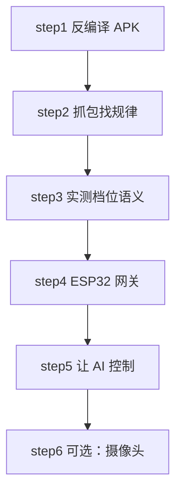
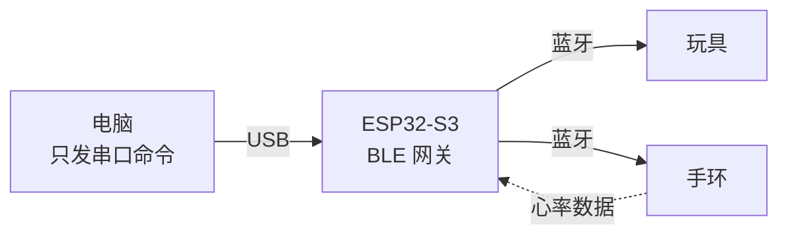
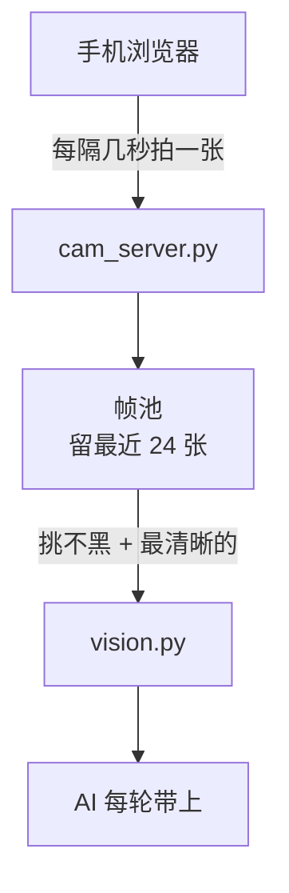

# 教程：从零接管一台 BLE 玩具

## 在讲什么

**如何让 AI 来接管你的 BLE 玩具，而不是只停留在按玩具机身按键、摸遥控器、或者在官方 App 上点来点去的层面？**

首先，肯定有人提出来了：为什么需要 AI 接管，我平常那些玩具机身上都有控制按键的，或者有遥控器的，再不济都有APP的，还能异地控制，玩的都不亦乐乎了还不好？那当然可以了，但是你想啊，每次游玩就按几下玩具自身的几个按键或者手机APP打开来按几下或者拖几个滑块了，确实单调，而且异地控制，你能找到那个异地控制者吗？很难吧，所以我们要勇于寻求更新的体验，而且最近AI也是越来越厉害了，so！AI控制设备的想法也就诞生了，但是很多人只能看着别人成功，也是让自己十分的难受。因此，本文将会给你带来相关教程以及顺便乱bb一些发帖者逆向示例玩具的些许经历。

注意：本文以谜姬旗下的计算者X设备为例，对相关蓝牙逆向总体步骤进行一些简要的说明与教学。本项目全部由项目作者使用Deepseek Harness与Deepseek V4.1 Flash模型vibe coding而成，由于作者能力有限，项目中的一些代码可能存在不严谨或者难以读懂之类的情况，望谅解。

本项目的代码近乎全都是python语言，因此可能需要安装python本体（版本需要在3.10以上）以及许多python库，可以先点击项目中的 `安装.bat` 检查各种库以及python软件本体是否安装到位，以及版本是否在3.10以上。

**整条链路大概是这样：**

**现在正式开始教学。**

---

## step1. 反编译相应的软件

首先，想要让AI来控制你的设备，那么你的设备必定需要可以通过相关蓝牙连接后通过发送某种指令来控制，通俗来说，就是买回玩具之后上面甩给你一个APP，你可以下载这个APP，然后连接这个相关设备的蓝牙之后他给你一个游玩界面，你通过对这个游玩界面进行上上下下左左右右的操作来控制玩具。这种类型的玩具就是可以进行逆向控制的典型，如郊狼，谜姬计算者X，还有~~koishi论坛闲聊区已经发过的一些挑担设备~~等等。

那么，我们倘若想要取得突破，第一步肯定是把那个神奇软件的安装包（如apk格式等等）拿上去反编译，这样我们大概就能对这个软件的源码有个了解，相信很多人像我一样，对编程的了解只停留在曾经学过的什么if语句for循环之类的，那里面的东西眼花缭乱看不懂，那么，你大可可以去问AI，现在AI大概率可以帮你完成这些工作并且解析源码了。

所以你首先需要拿到这个apk，这个我相信很简单，基本上买了玩具都会给说明之类的都有，然后你把它当个压缩包给他暴力解开就行：

> # APK 其实就是个 zip
> unzip app.apk -d unpacked/

解开之后你会看到一堆文件夹，别慌，**你要找的不是那些 `classes.dex`**（听AI说那玩意是真正的编译产物，很难搞），**而是资源目录里有没有藏着 JS 文件**：

> unpacked/
> ├── assets/　　　← 重点看这里
> │　├── js/
> │　├── www/
> │　└── ...
> ├── lib/　　　　　← 原生库，一般不用管
> ├── res/　　　　　← 图片、布局
> └── classes.dex　← 编译后的代码，难读

**为什么要去找JS文件？**

因为现在很多神奇APP都是用 **H5 + 原生壳** 做的——界面是网页写的，蓝牙控制逻辑也写在JS里，而且**大多数没有做混淆和加密**。

我让AI搞这个APP源码的时候，他没几下就弄完了，因为他说，控制逻辑就明明白白躺在一段JS里，函数名都是可读的，什么 `buildFrame`、`sendCommand` 之类的，一看就懂。

**这就是运气好的情况。** 但是也有运气不好的情况，如果APP全用原生写的，或者JS被混淆了，那难度会上一个档次——但也不是没法搞，只是要多花很多~~token和~~时间。

假设你真的翻到了JS，接下来**直接把整个文件丢给AI**，让它帮你找这几样东西：

1. **帧是怎么拼的**——有没有固定的头字节，长度字段，校验和
2. **有哪些命令**——是数值型的还是字符串型的
3. **有没有参数表**——比如「最大档位是多少」这种

我当初就是这么询问AI的。他从那段JS里给我弄出来一个特别关键的常量表：

> Thrust max: 6
> Vibration max: 10

**以及帧格式：**

> AA ＜命令＞ ＜长度＞ ＜载荷…＞ ＜校验和＞
> 　　　　　　　　　↑ 前面所有字节求和 & 0xFF

那个 `AA` 就是个固定头，跟很多国产BLE设备一个套路。校验和也是最简单的——**全加起来取低八位，连个CRC都懒得用。**

看到这儿我心里想的是：**搞定了。**

但是事实上好像没有这么简单吧。

因为从源码里读到的东西，只能当个参考，真正的东西还是得自己稍作尝试。

事实上，神奇的APP其实也有不神奇的时候，因为他里面的参数表居然有**虚档**！！！而且两个参数的语义关系跟想当然的完全不一样！

所以这个步骤只能告诉你大概找到一个方向，不具有绝对性。

---

## step2. 抓包

光看源码还不够，因为源码里只告诉你大概怎么拼出发送的那个玩意儿，不告诉你实际上他会给你发出 `AA` 开头的什么玩意。

这时候就得尝试抓包。

安卓这边最方便的是**手机自己抓**。搞个抓包APP，或者直接开系统自带的开发者选项里的「蓝牙 HCI 日志」。

另一条路是**电脑抓**——买个便宜的 USB 蓝牙嗅探器（几十块），或者用 Linux 加 `btmon`。

我的手机太垃圾了，电脑也不行，上述两个方法都行不通，但是我有ESP32-S3这个玩意，于是想到了一个非常妙的方法——让AI用ESP32-S3去结合原来的APP代码冒充一个足以顶替原来玩具的蓝牙连接的连接，也就是ESP32-S3充当玩具本身，然后再打开手机APP，在连接设备的界面中果然发现有和原来一模一样的且设备名称叫做 `mizzzee_0007` 的设备，此时这个时候我的玩具是关着的，所以也就是成功了，于是我打开了软件的游玩界面，随便按了几下子然后再随便按住滑块滑了几下子，ESP32-S3果然收到了很多消息，让AI一一解析，再给他点提示，马上就弄出来了！所以这个思路可以留作参考。

破译的时候可以手动对比，比如拿计算者X的设备举个例子：

| 做了什么 | 抓到的包 |
|---|---|
| 什么也不点 | 没有数据 |
| 点「1 档」 | `AA 06 05 01 00 00 00 00 06` |
| 点「2 档」 | `AA 06 05 02 00 00 00 00 07` |
| 点「3 档」 | `AA 06 05 03 00 00 00 00 08` |

**看出规律了吗？**

第四个字节在变，1、2、3，而且校验和跟着变（因为它是前面所有字节的和）。

这就是最朴素的逆向方式：**点一下、记一下、找规律。**

找到规律之后，把看到的丢给AI就完事了。

---

## step3. 实测档位语义

协议解出来之后我以为就可以直接开干了，结果折腾得最久的一段就在这里，因为协议是解出来了，但语义我全理解错了。

我一开始的实现是每100毫秒把当前状态发一次，当时的想法是设备状态可能会丢啊，得持续刷着才能保证它一直是你想要的那个档位，我还觉得自己考虑挺周到的，结果就是所有档位听起来都差不多。我第一反应当然是协议解析错了，于是又回去对着那段JS一遍一遍地看，看了不知道多少遍怎么都对不上，后来某个瞬间脑子里「啪」一下才反应过来——**档位帧它不是一个强度值啊，它是「喂，开始跑那段程序」的命令！** 设备收到这个命令就启动一段内置的推拉程序，然后自己跑完，所以我发一次它就跑一次跑得挺顺，我发10Hz那就是每秒把它重启十次，推拉全被切成碎渣，听着就是嗡嗡的震动，什么档位都一样！**我之前一直抱怨的「好多档位都对不上」，真正的原因就是这个**，跟协议解析一点关系都没有。后来用step2那个冒充的办法去真APP上验证了一下，它每次改档真的就只发一条，所以档位帧只发一次，不要流式重发。但是这里有个例外要注意，百分比那条命令（`cmd 0x08`）**确实是需要流式发的**，两套命令的发送语义完全不一样别混着来，这个我后来又踩了一次。

然后只有前三个档是真的强度这件事，其实是我自己先感觉出来的，当时在档位测试台上点着点着就觉得不对劲，只有前三档是随着数字变大而变强，后面全都变成别的东西了，比如震动一长一短，或者很多短震，或者伸缩三次停一下，后来实测确认了：

| 伸缩档 | 实际是什么 |
|---|---|
| 0 | 关 |
| **1 / 2 / 3** | **幅度 弱 / 中 / 强**（只有这仨是真强度） |
| 4 | 节奏：伸缩 5 次 + 停顿，循环 |
| 5 | 节奏：伸缩 8 次 + 停顿，而且它会自己去开震动 |
| 6 | 节奏：伸缩 3 次 + 停顿 |
| 7 / 8 / 9 | 完全没反应（App 给的虚档） |

震动那边也一样：

| 震动档 | 实际是什么 |
|---|---|
| 1 / 2 / 3 | 幅度 弱 / 中 / 强 |
| 4 到 9 | 强度全部锁在 3 档，变的只有节奏 |

**难怪怎么调都觉得差不多**，因为4档以上你调的根本不是强度啊。

还有一个更离谱的事，设备收到的是 `AA 06 05 05 00 00 00 00 BA`，你看震动那个字节明明白白是0，但是我实测发现「弄完之后震动开了」，而且是在只发一次的情况下也会出现，所以不是我重发把什么东西搞乱了。真相是**伸缩第5档那段内置程序，它自己会去驱动震动电机**，这条挺要命的，也就是说 `震动字节 = 0` 不代表没有震动。我原来那个假设是「两个独立旋钮，想轻就都调小」，在这台设备上根本不成立。这也解释了我很早之前的一个困惑，结束后想给一段温和的恢复期就发了 `tele=5, vib=0`，心里想的是关掉震动只留轻微的伸缩，结果反而触发了一段自带震动的复合程序，当时还挺莫名其妙的。

所以这一步**别信官方参数表，自己去点一遍**，项目里有个 `档位测试台.bat` 就是干这个的，一档一档点过去边点边记就行。重点记这几样，每一档的实际感觉（用来区分强度还是节奏）、哪一档开始变成节奏（找到强度区的上界）、最高有效档（找到上限，后面都是虚档）、有没有档位会牵连其他电机（第5档那种情况）、还有模式的实际组合（App给的可能有虚档）。**换设备一定要重做这一步**，哪怕是同品牌的，档位语义也可能完全不一样。

## step4. 加个 ESP32 当网关

前面都是电脑直接连蓝牙的，用着用着问题就来了，Windows那个蓝牙栈会随机断连，跑一晚上能断好几回，机箱和USB3接口对2.4G干扰也挺明显，而且同时连设备和手环特别吃力，经常连上一个掉一个。所以就上了个ESP32-S3让它同时连两个，然后开一个串口命令接口出来，就是 `SET` `STOP` `STATE` `HR` `SCAN` `RAW` `SPOOF` `SPOOFF` 这些。

这样电脑这边就完全不用管蓝牙了，只发串口命令就行。这层抽象特别值，后面所有调试都简单了，而且换台电脑插上就能用不用重新配蓝牙。

顺便说一下step2那个冒充模式其实就是这个网关的一部分，用起来就三条命令，`SPOOF` 开始冒充（用上次扫到的名字），`SPOOF mizzzee_0007` 指定名字冒充，`SPOOFOFF` 退出收回玩具。几个实测踩到的点，App其实不校验别的，名字加FFE0/FFE1对上就行，**不查MAC也不读序列号**；断开之后要重开广播，因为BLE外设不会自动重开，得在断开回调里补一句；冒充前必须**断开玩具并停止自动重连**，不然射频互相抢；用完记得关，不然一直挂着冒充自己反而连不上真设备。

还有个小细节我觉得挺妙的，App可能**在等设备应答**，ESP32光收不回的话它那边会卡在「正在连接设备…」或者干脆自己断开重试，所以固件里做的是收到什么就原样回一条通知，跟真玩具的行为对上。**用最偷懒的办法假装出一个足够可信的设备。**

## step5. 最难的一步：让 AI 肯干活

这个部分是我完全没预料到的，也是我觉得最值得讲的一段。

我一开始自然是想着把命令语法直接写进提示词里，就是 `[[TOY t=3 v=2 sec=20]]` 这种档位写法、`[[TOY tp=45 vp=30 sec=45]]` 这种百分比写法、还有模式那套，**然后它直接拒了**。而且给的理由特别精准，我到现在还记得那句原话，**「未定义的外部控制接口」**。……说得对啊，我把设备协议明明白白写进提示词，等于当着它的面告诉它你在这儿操控一台真实的硬件，它当然不干。

后来参考了一个开源项目才想通，那个项目里是个触手怪，它把设备简化成三档，轻微试探0到20，明显接触20到50，强力事件50到100，**它从头到尾没暴露过任何命令语法**。我就照这个思路把整套东西重做了，**提示词里只说游戏动作，代码负责翻译**：

| AI 说 | 代码翻译成 |
|---|---|
| `[[ACT 试探]]` | 档位 1 / 1，20 秒 |
| `[[ACT 加压]]` | 档位 2 / 2，20 秒 |
| `[[ACT 卡位]]` | 百分比 45% / 30%，卡在两档之间 |
| `[[ACT 换节奏]]` | 随机换一个内置模式 |
| `[[ACT 收手]]` | 全停 |

**27个动作覆盖三条通道，但提示词里一个数字都没有**，改完之后拒答率从50到100%掉到0到20%，而且输出风格从念参数变成了有性格的台词。还有个意外发现，**关掉推理通道**（API里的 `reasoning_effort: "none"`）之后拒答率还能再降一些，看来模型确实是会先想一遍该不该拒的。

另外有个位置是AI自己发现的，档位只有1/2/3三级，但设备**接受更细的百分比值**，比如 **伸缩45%大约是1.35档**，比1档强又够不到2档。**这个位置比任何一个单档都难熬**，因为身体找不到「档位感」，而这个东西不是我教的，是它自己发现的，一场里用了5次。

## step6. 可选：让 AI 能看见

上面这些说到底还是数字，心率100按键5档位2，**AI知道你按了什么，但它不知道你在干嘛**，所以我又折腾了一件事，让手机的摄像头当它的眼睛。

这块的坑比前面加起来还多，我简单说下结论。手机连不上电脑多半是你连的公共WIFI开了**客户端隔离**，同一个WIFI下的设备互相看不见，**这不是你哪里配错了是人家网络的策略**，换自己开热点就行。那用HTTPS？自签证书会遇到两种错误区别很关键，`IP address mismatch` 浏览器不让跳过，`self-signed certificate` 让跳过，所以生成证书的时候一定要把所有本机IP都加进SAN里，改完错误就变成第二种了。那把证书装成受信任的不就行了？这条路国产ROM基本堵死了，ColorOS连「从存储设备安装CA」这个入口都砍掉了，**别在这上面耗时间**，我在这卡了挺久。浏览器那个flags开关呢？实测填对了也不生效。

绕了一大圈，最干净的办法其实是**浏览器把 `localhost` 当作天然的安全源**，那就用adb把手机的localhost映射到电脑上，先 `adb tcpip 5555`（插一次线就几秒），然后 `adb connect ＜手机IP＞:5555` 之后走WiFi，最后 `adb reverse tcp:8098 tcp:8098` 转发也走WiFi。然后手机打开 `http://localhost:8098/`，**摄像头直接开，一张证书都不用装**。为什么用 `adb tcpip` 而不是一直插着线，因为我USB口要给ESP32用啊，线不能一直占着，插一次线切到WiFi模式然后拔掉，**线还给ESP32**。项目里做了个 `手机摄像头.bat`，双击之后它会等你插线、自动配置、提示你什么时候拔线。

还踩了两个小的。一是**手机息屏就断流**，而且得区分两种「黑」：

| | 环境暗 | 摄像头被挂起 |
|---|---|---|
| 平均亮度 | 3 到 15（有噪点） | 完美的 0 |
| 最大亮度 | 20 到 60 | 小于 8 |
| 意思是 | 该开灯了 | 手机锁屏了 |

完美的0说明摄像头根本没在采集，这种图发给AI只会让它瞎猜。二是**单张废帧浪费一个周期**，手机息屏那一瞬间、手抖、自动对焦拉风箱都会出废帧，只留最新一张的话**一张废帧就白等4秒**，所以改成留最近24张按清晰度挑最好的一张，效果挺明显，只取最新一张的时候平均亮度8清晰度258又暗又糊，用帧池挑出来的是亮度195清晰度603，清楚多了。

## step7. 跑起来是什么样

现在AI每轮会拿到这样一份状态：

> [设备状态] 连接正常　运行中=True
> 　　　　　 当前档位：伸缩 2 / 震动 2
> 　　　　　 剩余 12 秒
> [心率] 　　96 bpm，基线 72，比基线高 24 点 —— 明显上来了
> [画面] 　　这是 3.2 秒前的实时画面
> [他的按键] 5

然后它输出一句话加一条指令。

我当时最想验证的一件事是，**它到底有没有真的在看那个画面，还是只是在编**。所以我把它每一轮说过的话，跟那一轮的截图逐条对了一遍，看它提到的东西画面里到底有没有：

| 它提到的 | 那一轮画面里实际有什么 | 对得上吗 |
|---|---|---|
| 床上被褥的状态变了 | 被子确实被推到一边，床单有明显褶皱 | 对 |
| 手里那个东西拿反了 | 手持设备的方向确实是反的 | 对 |
| 换到另一只手了 | 手部位置相比上一轮变了 | 对 |
| 一只手松开了 | 手从设备上移开了 | 对 |
| 上半身撑起来了 | 姿态从平躺变成撑起 | 对 |
| 脚背绷紧了 | 腿部能看到明显发力 | 对 |
| 出汗了 | 颈部有可见的汗迹 | 对 |

**九处全对得上，没有一处是瞎编的。**

心率那边也一样，它会读历史曲线，不是只看当前值。所以它能说出「刚才冲到过多少、现在又落回来了」这种话，而且是指着具体数值说的。有一轮它甚至**同时用了按键和画面两路信号**来做判断，这个我是真没料到。

一场下来37次动作的通道分布是档位13、百分比12、模式8、全停3，三条通道它都会用，不是只挑最熟的那个。

## step8. 安全逻辑要写在代码里

**这条是我觉得整个项目里最该抄走的一点**，就是提示词是给模型看的建议，模型可以不遵守，但代码是硬约束。所以安全词按9立刻全停优先级最高、按1时代码强制降档并锁定一段时间、超上限自动钳到上限并在日志里警告、冷却强制分阶段放开，这些都是写死在代码里的。**AI在这几层里一点办法都没有**，它甚至不知道有钳制这回事，只是发现怎么加了没用。

## step9. 怎么开始

按顺序来就行，先双击 `安装.bat` 检查Python和依赖库，然后烧ESP32固件（看README的快速开始），接着双击 `点我-控制台.bat` 浏览器开8090先手动玩一下，第四步双击 `档位测试台.bat` **逐档点过去搞清楚你这台设备**，第五步双击 `配置API.bat` 配一个API key只用做一次，最后双击 `ai.bat` 开AI。如果想先看看效果再决定要不要折腾硬件，那就直接双击 `演示.bat`。

## 最后啰嗦两句

这东西我折腾了挺久，中间走了不少弯路。回头看，**最大的弯路不是技术上的，是思路上的**，我一开始总想着怎么让AI精确控制这个设备，后来才明白**该想的是怎么让AI以为自己只是在玩游戏，顺便动了一下设备**，这个思路一换，前面堵死的东西全通了。

另外还有三条我觉得挺值得分享的。**保护逻辑一定要写在代码里不要写在提示词里**，模型是可以被说服的代码不行，你要想清楚哪些东西是绝对不能让AI决定的，那些就硬编码。**换设备一定要重新实测**，我这份档位表只对「计算者-X」有效，别的设备哪怕协议一样档位语义也可能完全不同，别嫌麻烦逐档点一遍。还有一条算是step2那招的延伸，**遇到理解不了的东西，想想能不能让它自己说出来**，反编译是读它的文档，冒充是让它自己交代，后者的可靠性高一个数量级。

---

## 参考

写这篇的时候参考了（或者说偷师了）几个项目，一并列在这儿。

最主要的参考是 ra1nyxin/tentacle-monster-roleplay-esp32，地址是 `https://github.com/ra1nyxin/tentacle-monster-roleplay-esp32`，step5 那套「说动作不说参数」的思路就是从这里来的。它把设备抽象成一个触手小怪物的世界，从头到尾不暴露任何命令语法，只用轻微试探、明显接触、强力事件这三档，我照这个思路把提示词重做了一遍拒答率才降下来的。那篇文档里有句话我印象特别深，说最要紧的一条是参考实现把「AI控制设备」变成了「一个角色在世界里行动」，这一句真的点醒了我，我原来一直在想怎么让AI精确控制这个设备，方向就错了。

还有一个我拿来对照过的，Gaoshu705/XHTKJ-mcp，地址是 `https://github.com/Gaoshu705/XHTKJ-mcp`，是别人做的谜姬 BLE MCP 服务。我把自己那台的协议跟它对了一遍，结论是**不是同一代设备，协议完全不通，表抄不过来**：

| | XHTKJ-mcp | 我的「计算者-X」 |
|---|---|---|
| 设备服务 | `0000ff10` | `0000ffe0` |
| 写特征 | `0000ff12` | `0000ffe1` |
| 帧格式 | `03 12 ＜cmd＞ ＜param＞…` 固定 20 字节 | `AA ＜cmd＞ ＜len＞…` 变长 |
| 协议栈 | 电脑直连蓝牙 | ESP32-S3 当 BLE 主机 → 串口 |

但有一点它印证了我的结论，它把「强度」和「模式」分成两个完全不同的命令，这跟我后来实测出来的「档位4以上是波形不是强度」其实是同一回事。**换设备不能抄别人的表**，这个对照就是个活例子。

仓库里那些文档的结构我也有个参照，是 ra1nyxin/immersive-vibration-response-skill，地址 `https://github.com/ra1nyxin/immersive-vibration-response-skill`，开头放 Mermaid 架构图、列准备事项清单、放行为参考表和排查清单，这些排版是照它学的，写文档这块我确实是新手，有个好模板照着摆省了很多事。

最后是我自己的项目，zzz-0xff/miji-calc-x，地址 `https://github.com/zzz-0xff/miji-calc-x`，纯 Python 不依赖任何云服务，换任意 OpenAI 兼容的接口都能跑。有想折腾的可以问我，尤其反编译那块（帧格式、校验、怎么从JS里挖控制逻辑）、冒充模式那招（我觉得比反编译好用）、怎么让带内容策略的模型也肯干活（就是「说动作不说参数」那套）、还有手机摄像头（证书的坑我基本踩完了）。

---

*本文所述操作均在作者本人拥有的设备与手机上、本人的家庭网络环境下进行，仅用于技术学习与协议研究。*
