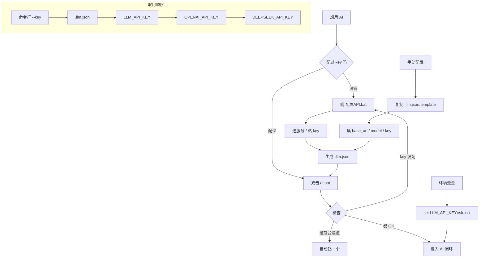

# AI 模块配置

AI 模块是**可选**的。不配也能用控制台手动控制，只是少了"它自己决定下发什么"这部分。

---

## 配置流程


\
## 最快的方式：跑配置向导

```
配置API.bat
```

它会问你要用哪个服务、把 key 粘进去，然后自动生成 `.llm.json`。

**不用手动编辑 JSON。**

---

## 手动配置

如果向导跑不了，就自己建一个 `.llm.json`，放在**项目根目录**（和 `README.md` 同一层）：

```json
{
  "base_url": "https://api.deepseek.com",
  "model": "deepseek-chat",
  "key": "sk-你的key"
}
```

三个字段：

| 字段 | 填什么 |
|---|---|
| `base_url` | 接口地址。**注意有些要带 `/v1`，有些不带**，见下表 |
| `model` | 模型名 |
| `key` | 你的 API key |

> `.llm.json` 已经在 `.gitignore` 里了，**不会被提交**。

---

## 常见服务怎么填

| 服务 | base_url | model | key 在哪拿 |
|---|---|---|---|
| **DeepSeek** | `https://api.deepseek.com` | `deepseek-chat` | [platform.deepseek.com/api_keys](https://platform.deepseek.com/api_keys) |
| **OpenAI** | `https://api.openai.com/v1` | `gpt-4o-mini` | [platform.openai.com/api-keys](https://platform.openai.com/api-keys) |
| **本地 Ollama** | `http://127.0.0.1:11434/v1` | `qwen2.5` | 随便填个非空字符 |
| **本地 LM Studio** | `http://127.0.0.1:1234/v1` | 你加载的模型名 | 随便填 |

### ⚠ 关于 `base_url` 要不要带 `/v1`

**这一步最容易错。** 代码会在你填的地址后面接 `/chat/completions`：

```
你填 https://api.deepseek.com
   → 实际请求 https://api.deepseek.com/chat/completions        ✓

你填 https://api.openai.com/v1
   → 实际请求 https://api.openai.com/v1/chat/completions       ✓

你填 https://api.deepseek.com/v1        ← 也能用，DeepSeek 两种都接受
你填 https://api.openai.com             ← ✗ 会 404
```

**判断方法**：看你服务商的文档，`POST /chat/completions` 前面那段就是 `base_url`。

---

## 用环境变量（不想建文件的话）

```bash
# Windows
set LLM_API_KEY=sk-你的key
python ai_demo.py

# 或者直接传
python ai_demo.py --key sk-你的key --base-url https://api.deepseek.com --model deepseek-chat
```

取用顺序：

```
命令行 --key  →  .llm.json 里的 key  →  $LLM_API_KEY  →  $OPENAI_API_KEY  →  $DEEPSEEK_API_KEY
```

---

## 怎么确认配好了

```bash
python ai_demo.py --help
```

会列出当前的地址和模型。或者直接跑 `模型对比.bat`，它会打印出每个模型有没有拿到 key：

```
[OK] DeepSeek         deepseek-chat  key sk-8a6…a52c
[--] 模型 B     没有 key（设 LLM_API_KEY 环境变量）
```

**`[--]` 就是没配上。**

---

## 模型怎么选

用中性提示词（`prompt.assistant.txt`）实测过几个：

| 模型 | 表现 |
|---|---|
| **DeepSeek** | 中文最自然，像在跟人说话 |
| GPT 系（走中转） | 也行，但输出偏"报告腔" |

同一个场景的对比：

```
【DeepSeek】
  心率快上来了，再加一档我盯着你。
  [[CMD t=3 v=2 sec=20]]

【模型 B】
  我注意到你呼吸加重，先维持当前档位观察。
  [[CMD t=2 v=2 sec=12]]
```

想看对比自己跑：

```
模型对比.bat
```

---

## 想接别的模型

**任何 OpenAI 兼容的接口都能用。** 只要它有 `POST /chat/completions` 这个端点。

拿两样东西就行：

| | 从哪看 |
|---|---|
| `base_url` | 服务商文档里，`/chat/completions` 前面那一段 |
| `model` | 服务商给的模型名 |

**举例**（具体数值以服务商文档为准）：

| 服务 | base_url | model |
|---|---|---|
| OpenAI | `https://api.openai.com/v1` | `gpt-4o-mini` |
| DeepSeek | `https://api.deepseek.com` | `deepseek-chat` |
| 本地 Ollama | `http://127.0.0.1:11434/v1` | `qwen2.5` |
| 本地 LM Studio | `http://127.0.0.1:1234/v1` | 你加载的那个 |
| 自建 / 中转 | 服务商给的地址 | 服务商给的模型名 |

填进 `.llm.json` 的 `base_url` 和 `model` 就完事。

### 想同时比几个模型？

改 `tools/models.json`，那是个列表：

```json
[
  {"name": "DeepSeek", "base": "https://api.deepseek.com",
   "model": "deepseek-chat", "envs": ["DEEPSEEK_API_KEY"]},
  {"name": "我自建的", "base": "http://192.168.1.100:8000/v1",
   "model": "qwen2.5-14b", "envs": ["LLM_API_KEY"]}
]
```

然后跑：

```
模型对比.bat
```

就会把同一份状态分别发给这几个，输出并排看。

---

## 出问题了

| 现象 | 原因 |
|---|---|
| `401 Unauthorized` | key 错了或者过期了 |
| `404 Not Found` | **`base_url` 少了或多了 `/v1`** —— 见上面那节 |
| `model not found` | 模型名写错了，看服务商文档 |
| 连不上 / 超时 | 检查网络。有些服务在国内要代理 |
| 输出是空白 | `max_tokens` 太小，或者模型把这个请求拦了 |

---

## 关于「拒答」

中性提示词（`prompt.assistant.txt`）实测在各家模型上都不触发内容策略。

但如果你自己改提示词，**注意一条**：不要在里面写设备的技术参数，比如

```
✗ [[TOY t=3 v=2 sec=20]]        ← 把命令语法写进提示词
✓ 用 [[CMD 动作]] 这种语义写法     ← 只说动作，代码翻译
```

把设备协议直接写进提示词，模型会读成「未定义的外部控制接口」然后拒绝。

这个项目的 `ai_demo.py` 就是这么设计的 —— 提示词里只有动作名，参数全在代码里。

---

*这份文档由 DeepSeek 协助整理。*