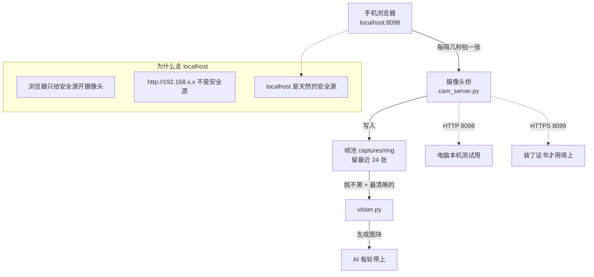

# 手机摄像头接入

让 AI 能"看见"现场的手部动作和身体反应，而不只是读心率数字。

**这是个可选模块。** 不接也能正常控制设备，只是 AI 少一路输入。

## 结论先行

**别跟证书较劲。用 `adb reverse` + `localhost`。**

```bash
adb tcpip 5555                     # 插一次线，几秒
adb connect <手机IP>:5555          # 之后走 WiFi
adb reverse tcp:8098 tcp:8098      # 转发也走 WiFi
```

然后手机浏览器打开：

```
http://localhost:8098/
```

**不需要任何证书。** 摄像头自动开，每隔几秒拍一张传过来。

> 或者直接双击 `手机摄像头.bat`，脚本会做完这些并提示你什么时候拔线。

## 整条链路



## 为什么不能用普通的 HTTP 访问

浏览器有一条硬规则：**只有「安全源」才能调用摄像头。**

| 地址 | 是安全源吗 |
|---|---|
| `https://...` | 是 |
| `http://localhost` | **是** ← 关键 |
| `http://127.0.0.1` | 是 |
| `http://192.168.x.x` | **不是** |

所以手机访问 `http://192.168.x.x:8098` 时，浏览器**拒绝开摄像头**。

而 `http://localhost:8098` 就可以 —— **哪怕它实际上是在访问另一台机器**（adb 转发过去的）。

## 踩过的坑（按顺序）

### 坑①：同网段也连不上 —— 公共热点有客户端隔离

如果手机和电脑连的是**公共 WiFi**（咖啡馆、酒店、机场，或者运营商热点），很可能打不开。

**原因**：这类热点默认开启 **AP 隔离（客户端隔离）** —— 同一 WiFi 下的设备互相看不见。

| | |
|---|---|
| 是配置问题吗 | **不是**，是这个网络的策略 |
| 怎么办 | 换网络，或者自己开热点 |

自测方法：手机访问电脑的 IP，超时就是被隔离了。

### 坑②：HTTPS 自签证书 —— 两种错误，一种能跳一种不能

自己开热点绕过隔离之后，手机能打开网页了，但摄像头还是不开。那就得上 HTTPS。

自签证书会遇到两种错误，**区别很关键**：

| 浏览器报错 | 能点「继续访问」吗 |
|---|---|
| `IP address mismatch` | **不能** |
| `self-signed certificate` | **能** |

**第一种是主机名不匹配** —— 通常是证书的 SAN 里没有你访问的那个 IP。

生成证书时一定要**把所有可能用到的 IP 都加进 SAN**：

```python
san = x509.SubjectAlternativeName(
    [x509.DNSName("localhost")] +
    [x509.IPAddress(ipaddress.ip_address(i)) for i in 所有本机IP]
)
```

改完之后错误会变成第二种，**这种浏览器让你跳过**。

### 坑③：国产 ROM 装不了 CA 证书

每次都跳警告太烦，想把证书装成受信任的。**这条路在国产 ROM 上基本走不通。**

**第一关：报「需要私钥才能安装证书」**

这个报错**有误导性**。它其实是在说"这不像是张合法的 CA 证书"。

真正的原因是证书缺了 CA 扩展：

```python
.add_extension(x509.BasicConstraints(ca=True, path_length=None),
               critical=True)          # ← 缺这个就报"需要私钥"
.add_extension(x509.KeyUsage(
    key_cert_sign=True, crl_sign=True, ...),
    critical=True)
```

**第二关：报「没有可安装的证书」**

补上 CA 扩展之后换了报错。试了 `.crt` 和 `.p12` 两种格式都不行。

**结论：ColorOS 之类的国产 ROM 把「从存储设备安装 CA 证书」这个入口直接砍掉了。**

**这条路不用再试了。**

### 坑④：浏览器 flags 开关也不生效

Chromium 系有个开关：

```
chrome://flags/#unsafely-treat-insecure-origin-as-secure
edge://flags/#unsafely-treat-insecure-origin-as-secure
```

理论上填进去指定源，就能把 HTTP 当安全源。

**实测：填得完全正确，`window.isSecureContext` 还是 `false`。**

可能是版本差异或厂商定制。**别指望这个。**

### 正解：`adb reverse`

绕了一圈，最干净的还是这个。

```bash
# ① 插上 USB 线（手机要先开 USB 调试）
adb tcpip 5555

# ② 现在可以拔线了 —— adb 已经切到网络模式
adb connect <手机IP>:5555

# ③ 做端口转发（也走 WiFi）
adb reverse tcp:8098 tcp:8098
```

**手机打开 `http://localhost:8098/` → 摄像头直接开。**

### 为什么要用 `adb tcpip` 而不是一直插线

因为 USB 口可能要留给 ESP32 网关。

`adb tcpip 5555` 把手机的 adb **从 USB 切到网络**，之后拔线也不影响：

```
插线 → adb tcpip 5555 → 拔线 → adb connect <IP>:5555 → 全程走 WiFi
```

**USB 口只占用几秒。**

> ⚠ 手机重启后 `tcpip` 模式会失效，需要重新插一次线。

### 开 USB 调试

| 品牌 | 路径 |
|---|---|
| 通用 | 设置 → 关于手机 → **连点版本号 7 次** |
| OPPO / 一加 | 关于本机 → 版本信息 → 版本号；开发者选项在「系统设置」里 |
| 小米 / Redmi | 我的设备 → 全部参数 → OS 版本；开发者选项在「更多设置」里 |
| 华为 / 荣耀 | 关于手机 → 版本号；开发人员选项在「系统和更新」里 |
| vivo | 系统管理 → 关于手机 → 软件版本号；开发者选项在「系统管理」里 |

设置里搜「开发者」最快。

## 画面质量

### 光最重要

| 平均亮度 | 情况 |
|---|---|
| **0 且最亮 < 8** | 摄像头**被挂起**（不是环境暗！多半是锁屏了） |
| 3 ~ 30 | 太暗，识别不出来 |
| **60 ~ 150** | 最好 |
| > 220 | 过曝，反光糊成一片 |

**别对着显示器拍** —— 屏幕反光会过曝，而且方向也不对。

**推荐机位**：斜上方 45°，距离 50~80cm，把操作区域放在画面中间。

### 分辨率和画质

**画质参数比分辨率重要得多。**

```
720 × 1280、画质 88  →  信息密度 2.5 bit/像素     能认出来
720 × 1280、画质 72  →  信息密度 0.05 bit/像素    糊到认不出
```

页面上有三个滑条：

| 滑条 | 建议 |
|---|---|
| 画质 | **85 ~ 92** |
| 宽度 | 1280 |
| 间隔 | 4000 ms |

### 手机息屏就断流

**浏览器在后台会挂起视频轨道** —— 这是省电机制。

- 手机设置里把**自动息屏改成「永不」**
- 保持页面在**前台**
- 插着充电线时尤其建议这么设

## 帧池：为什么要留多张

手机息屏那一瞬间、手抖、自动对焦拉风箱 —— 都会产生废帧。

**只留最新一张的话，一张废帧就浪费一个采集周期。**

所以留最近 24 张，按「清晰度 + 新鲜度」挑最好的一张：

```python
scored.sort(key=lambda x: -(sharpness - age * 2.0))
```

清晰度用**拉普拉斯方差**算：

```python
lap = im.filter(ImageFilter.Kernel((3,3),
        [0,1,0, 1,-4,1, 0,1,0], scale=1, offset=128))
var = 统计方差(lap)
```

| 拉普拉斯方差 | 判定 |
|---|---|
| < 50 | 很糊（失焦 / 抖动 / 镜头脏） |
| 50 ~ 150 | 偏软 |
| 150 ~ 500 | 正常 |
| > 500 | 很锐利 |

实测效果：

```
只取最新一张:  亮度 8    清晰度 258   ← 又暗又糊
用帧池挑:      亮度 195  清晰度 603   ← 清楚
```

### 区分两种「黑」

| | 环境暗 | 摄像头被挂起 |
|---|---|---|
| 平均亮度 | 3~15（有噪点） | **完美的 0** |
| 最大亮度 | 20~60 | **< 8** |
| 含义 | 该开灯了 | 手机锁屏了 |
| 该做什么 | 加光 | 解锁手机、保持前台 |

**纯黑的图不要发给模型** —— 它只会瞎猜。改成一句文字说明。

## 文件说明

| 文件 | 作用 |
|---|---|
| `cam_server.py` | 手机端网页 + 接收上传。同时开 HTTP(8098) 和 HTTPS(8099) |
| `vision.py` | 挑帧 + 生成图块 + 给模型的画面提示 |
| `手机摄像头.bat` | 一键：等插线 → 切 tcpip → 提示拔线 → 连 WiFi → 配转发 |
| `tools/phone_watch.py` | 上面那个脚本的实现 |
| `tools/watch_serial.py` | 盯串口，ESP32 插上就报 |
| `tools/check_frame.py` | 看画面尺寸 / 质量 |
| `tools/frame_light.py` | 看亮度分布 |
| `tools/frame_sharp.py` | 算清晰度 |
| `tools/see_frame.py` | 让 AI 描述当前画面 |

## 排查清单

| 现象 | 原因 / 处理 |
|---|---|
| 手机打不开页面 | 手机和电脑同网段吗；**公共 WiFi 有客户端隔离**，换自己开热点 |
| 能打开页面，摄像头不开 | 地址必须是 `http://localhost:8098/`，`192.168.x.x` 不行 |
| `vision_block()` 返回 None | 画面超过 12 秒没更新，或者整张纯黑 |
| 画面全黑 | 跑 `frame_light.py`：亮度 0 = 锁屏了，3~30 = 光不够 |
| 画面很糊 | 跑 `frame_sharp.py`；方差 < 50 就是镜头脏或没对焦 |
| 传一会儿就停 | 手机自动息屏设成「永不」，保持浏览器在前台 |
| adb 报 `unauthorized` | 手机弹「允许 USB 调试」时点允许，勾上"一律允许" |
| `adb tcpip` 之后连不上 | 手机重启过，要重新插线跑一次 |

---

*这份文档由 DeepSeek 协助整理。*
